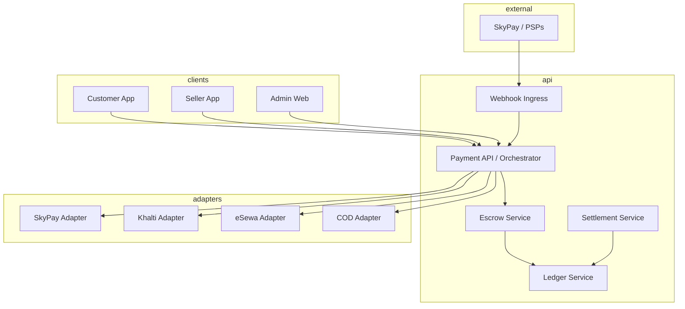
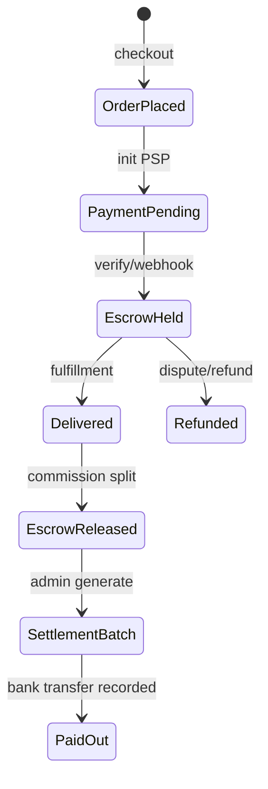
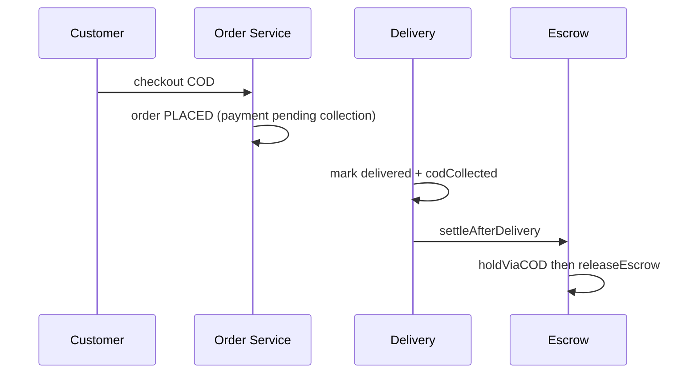

# GoPasal Payment Architecture

Enterprise marketplace payment stack for Nepal: **provider-agnostic adapters**, **escrow ledger**, **COD reconciliation**, and **admin treasury controls**.

## Design principles

1. **Never trust the client** — capture happens only after server verification (return URL, status API, or signed webhook).
2. **Sellers never receive PSP webhooks** — all money flows through platform accounting.
3. **Adapter pattern** — swap SkyPay, direct eSewa/Khalti, or future card rails without changing order/escrow logic.
4. **Idempotency** — `payments.idempotency_key`, `payment_attempts.idempotency_key`, ledger journal keys.
5. **Auditability** — `payment_audit_logs`, `webhook_events`, existing `audit_logs`.

## Layered architecture



## Provider resolution

| `SKYPAY_ENABLED` or credentials | Channel | Adapter |
|--------------------------------|---------|---------|
| yes | ESEWA, KHALTI, FONEPAY_QR, CARD | `SkyPayAdapter` |
| no | KHALTI | `KhaltiPaymentAdapter` |
| no | ESEWA | `EsewaPaymentAdapter` |
| any | COD | `CodPaymentAdapter` |

Interface: `backend/src/modules/payment/providers/payment-provider.interface.ts`

## Escrow lifecycle (online)



**Ledger accounts (examples):**

- `ASSET:PG_SETTLEMENT` — online collections
- `ASSET:CASH_ON_HAND` — COD
- `LIABILITY:ESCROW_HOLD` — customer funds held
- `LIABILITY:SELLER:{storeId}` — owed to seller
- `REVENUE:PLATFORM_FEES` — commission
- `ASSET:PLATFORM_BANK` — treasury out

## COD lifecycle



Future: populate `cod_records` on rider collection for admin reconciliation.

## Database (new + existing)

| Table | Purpose |
|-------|---------|
| `payments` | Canonical payment row per order attempt |
| `payment_attempts` | Per checkout try, provider, status |
| `escrow` | Held / released / refunded amounts |
| `ledger_*` | Double-entry journals |
| `settlements` / `settlement_items` | Seller payout batches |
| `refunds` | Full/partial refunds |
| `webhook_events` | Idempotent webhook store |
| `payment_audit_logs` | Payment-specific audit trail |
| `seller_payout_requests` | Seller-initiated withdrawal requests |
| `cod_records` | Rider COD collection (schema ready) |

Migration: `backend/drizzle/0014_payment_architecture.sql`

## API contracts

### Customer

| Method | Path | Description |
|--------|------|-------------|
| GET | `/api/v1/payment/config` | Enabled methods + aggregator |
| POST | `/api/v1/payment/checkout/init` | `{ orderId, channel }` → payment URL / QR |
| POST | `/api/v1/payment/checkout/verify` | `{ orderId, callback }` → capture |
| POST | `/api/v1/payment/khalti/verify` | Legacy direct Khalti |
| POST | `/api/v1/payment/esewa/verify` | Legacy direct eSewa |
| POST | `/api/v1/payment/webhooks/skypay` | SkyPay IPN |

### Seller

| Method | Path | Description |
|--------|------|-------------|
| GET | `/api/v1/seller/payments/wallet` | Escrow / available / pending |
| GET | `/api/v1/seller/payments/settlements` | Payout history |

### Admin (existing governance)

| Method | Path | Description |
|--------|------|-------------|
| POST | `/api/v1/admin/governance/refunds` | Manual refund |
| POST | `/api/v1/admin/governance/settlements/generate` | Batch |
| POST | `/api/v1/admin/governance/settlements/:id/payout` | Mark paid |

## Security

- Webhook HMAC (`SKYPAY_WEBHOOK_SECRET`)
- Replay protection via `webhook_events` unique `(provider, external_event_id)`
- Payment launch tokens for eSewa redirect
- Rate limits on auth/payment routes (extend as needed)
- Secrets only in env — never in client bundles

## Environment

```bash
# SkyPay assisted mode
SKYPAY_ENABLED=true
SKYPAY_API_KEY=
SKYPAY_API_SECRET=
SKYPAY_MERCHANT_ID=
SKYPAY_BASE_URL=https://api.skypay.example/v1
SKYPAY_WEBHOOK_SECRET=
SKYPAY_MOCK_ENABLED=true   # dev only

# Direct fallback when SKYPAY_ENABLED=false
KHALTI_SECRET_KEY=
ESEWA_MERCHANT_ID=
ESEWA_SECRET_KEY=
```

## Customer app

- `PaymentBottomSheet` — method picker + orchestrator init
- `payment/return` — verify via legacy or `/checkout/verify`
- Deep link / WebView fallback via `Linking.openURL`

## Future scaling

1. **Redis queue** for webhook retries and settlement cron
2. **Direct Fonepay / card adapters** implementing same interface
3. **Gateway refunds** in `refundPayment()` per adapter
4. **Auto settlement** job (weekly) + seller payout via bank API
5. **Fraud rules** — velocity limits, COD caps, device fingerprint
6. **Multi-currency** — extend `amount` + FX snapshot columns

## Code map

```
backend/src/modules/payment/
  providers/
    payment-provider.interface.ts
    payment-provider.registry.ts
    skypay/
    khalti/
    esewa/
    cod/
    fonepay/
  payment-orchestrator.service.ts
  escrow.service.ts
  ledger.service.ts
  settlement.service.ts
  webhook-processor.service.ts
  payment-webhook.controller.ts
  seller-wallet.service.ts
```
